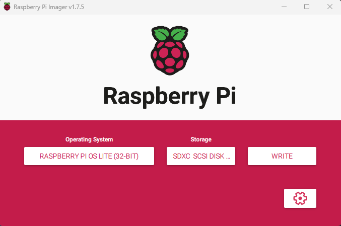
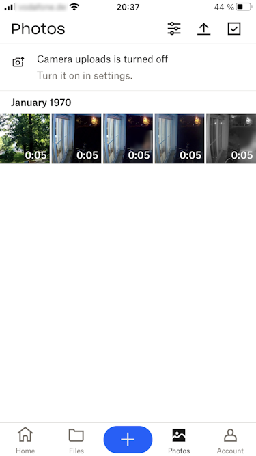

# RaspiAsUSBStickWithCloudSync

A [Raspberry Pi Zero W](https://rpilocator.com/) is used as a USB Stick with integrated cloud syncronization. All files written to the USB drive are either copied to a Dropbox account or another linux server. Power is supplied by the USB port. 

This can be used in conjunction with a camera system which has the possibility to store the video files locally on a USB stick, but not in the cloud.

Each new video file is automatically uploaded to a free Dropbox account and can subsequently be viewed and replayed with the Dropbox app.

Some very basic linux skills are necessary.

## Quickstart
Prepared for Debian Bookworm based Raspberry image. The Micro-SD card should be at least 16GB. 
1. Install Raspberry Pi OS Lite (32bit) with the [Raspberry Pi Imager](https://www.raspberrypi.com/software/). 

- Settings (Gear Symbol)
    > - Set Hostname: raspberrypi.local
    > - Enable SSH with Password
    > - Username: pi
    > - Password: YOUR_PASSWORD
    > - Setup your Wifi (important)

2. Download latest release from RaspiAsUSBStickWithCloudSync and extract files
3. Enter configuration data for Dropbox sync or linux server sync
    - [Prepare and configure Dropbox](doc/dropbox.md)
    - Configure linux server sync
4. Copy all files to `/home/pi` on the Raspberry Pi. For example use [WinSCP](https://winscp.net/eng/download.php):
    > - File protocol: SFTP
    > - Host name: raspberrypi.local
    > - User name: pi
    > - Password: YOUR_PASSWORD
5. Login to Raspberry Pi with SSH and execute command `bash /home/pi/execute_setup.sh`.
For example use [Putty](https://www.chiark.greenend.org.uk/~sgtatham/putty/latest.html) with `Host name: raspberrypi.local` and `user: pi`
> [!NOTE]
> The setup script downloads and installs necessary software components, configures driver modules as well as services and creates the USB drive image.
6. Restart and you are all set. For a first test connect the pi with it's USB port to your PC and see whether the USB drive is accessible. Create a folder with some files and check whether it is auto uploaded to configured Dropbox or linux server.
7. Connect to system of your choice, for example camera system with video sync to USB.

#### View videos in dropbox mobile app: 

## Diagnose
- Wifi
- Log Files
- Mount test

## More information
[Detailed documentation](doc/documentation.md)

### License
[GNU General Public License v3.0](LICENSE)

