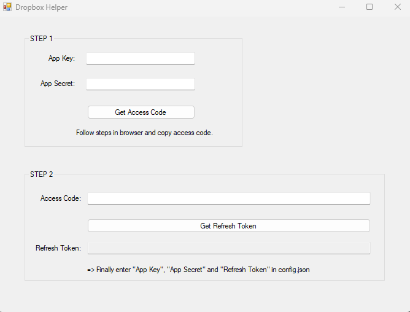

# Dropbox configuration

## 1. Create a new dropbox app

After creating a dropbox **Basic** account, a new app needs to be created in the developer [App Console](https://www.dropbox.com/developers/apps/).

> [!IMPORTANT]
> For accessing the dropbox account from RaspiAsUSBStickWithCloudSync three configuration settings are necessary:
> - APP_KEY
> - APP_SECRET
> - REFRESH_TOKEN
>
> Copy the APP_KEY and APP_SECRET from the app Settings page for later usage.

**On the Permissions page set the Files and Folder permissions and press Submit.**

## 2. Get the REFRESH_TOKEN

Use DropboxHelper application, or execute the [steps manually](dbmanual.md).

Enter APP_KEY and APP_SECRET from you apps setting page.

## 3. Enter settings in configuration file

Edit the file `config.json` with a text editor and replace the values for `DropboxAppKey`, `DropboxAppSecret` and `DropBoxRefreshToken` with your noted values.

Now everything is set up.