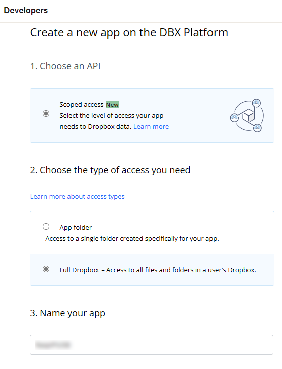
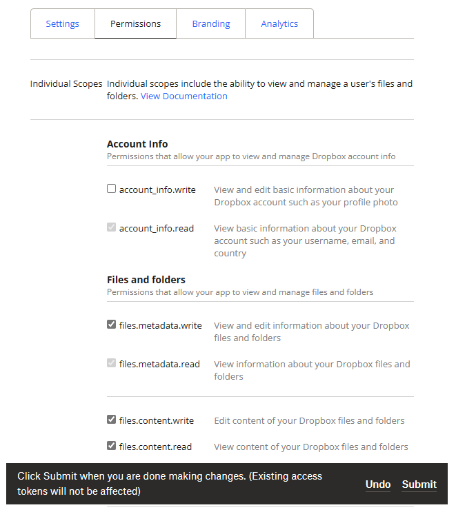
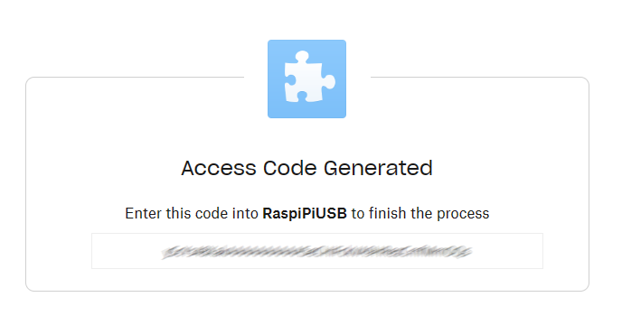
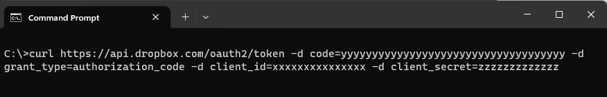
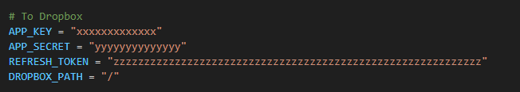

# Dropbox configuration

### 1. Create a new dropbox app

After creating a dropbox account, a new app needs to be created in the developer [App Console](https://www.dropbox.com/developers/apps/).



For accessing the dropbox account from RaspiAsUSBStickWithCloudSync three configuration settings are necessary:
- APP_KEY
- APP_SECRET
- REFRESH_TOKEN

Copy the APP_KEY and APP_SECRET from the app Settings page for later usage.

On the Permissions page set the Files and Folder permissions and press Submit.




### 2. Get the REFRESH_TOKEN

####  Get the access code

- Use a browser and log in to your dropbox account.
- Replace APP_KEY in the URL with the app_key from you apps setting page.
```
https://www.dropbox.com/oauth2/authorize?client_id=APP_KEY&response_type=code&token_access_type=offline
```
- Copy the URL to the browser and execute. Press -> Continue -> Allow.
- Copy the generated access code for later usage.


#### Call the token API

- Replace ACCESS_CODE, APP_KEY and APP_SECRET with your copied values in the command:
```
curl https://api.dropbox.com/oauth2/token -d code=ACCESS_CODE -d grant_type=authorization_code -d client_id=APP_KEY -d client_secret=APP_SECRET
```

- Execute you modified command in a Command Prompt:



- Finally copy the refresh token from the returned result.
>  ...
>  "token_type": "bearer",
>  "expires_in": 14400,
>  "refresh_token": "**aaaaaaaaaaaaaaaaaaaaaaaaaaaaaaaaaaaaaaaaaaaaaaaaa-1_bbbbbbbbb-y**",
>  "scope": "account_info.read files.content.read files.content.write files.metadata.read files.metadata.write",
>  ...


### 3. Enter settings in the upload script

Edit the file `upload_new_files.py` with a text editor and replace the values for APP_KEY, APP_SECRET and REFRESH_TOKEN with your noted values.



Now everything is set up.